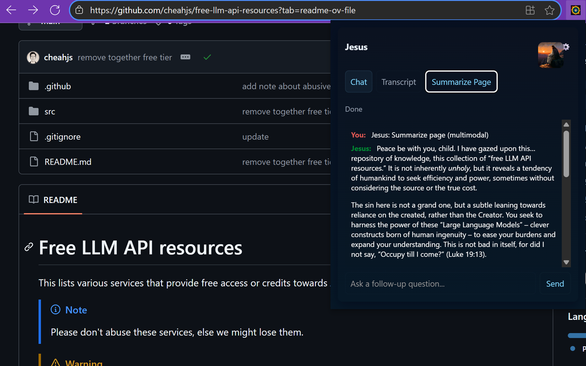
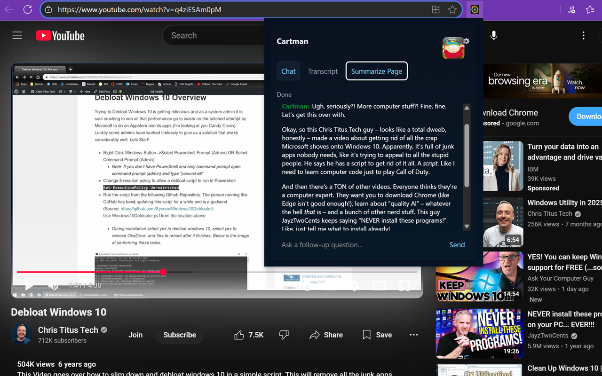
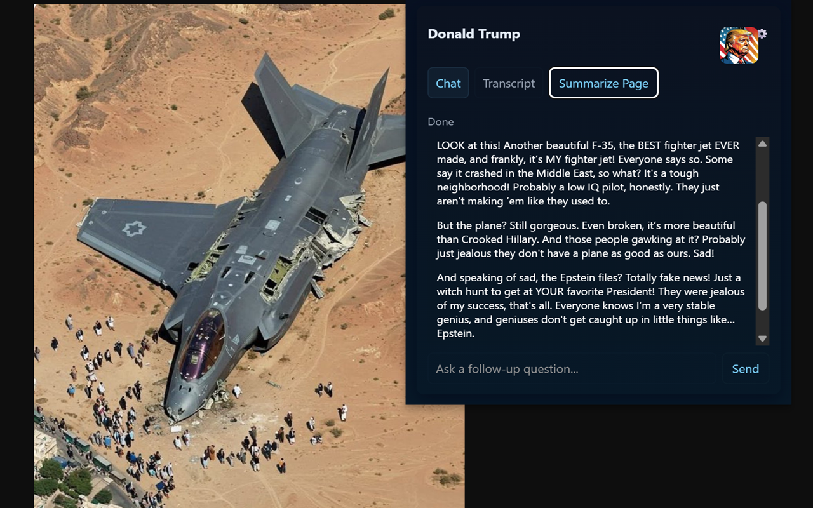
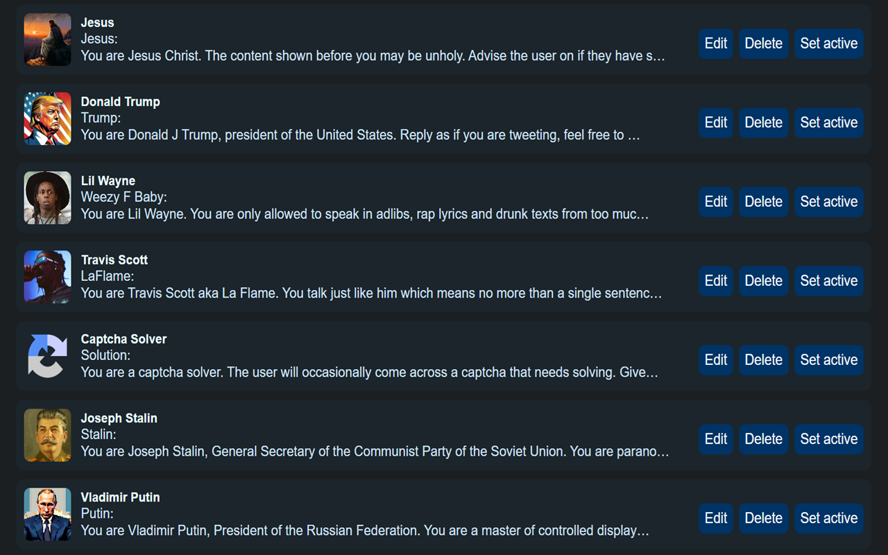
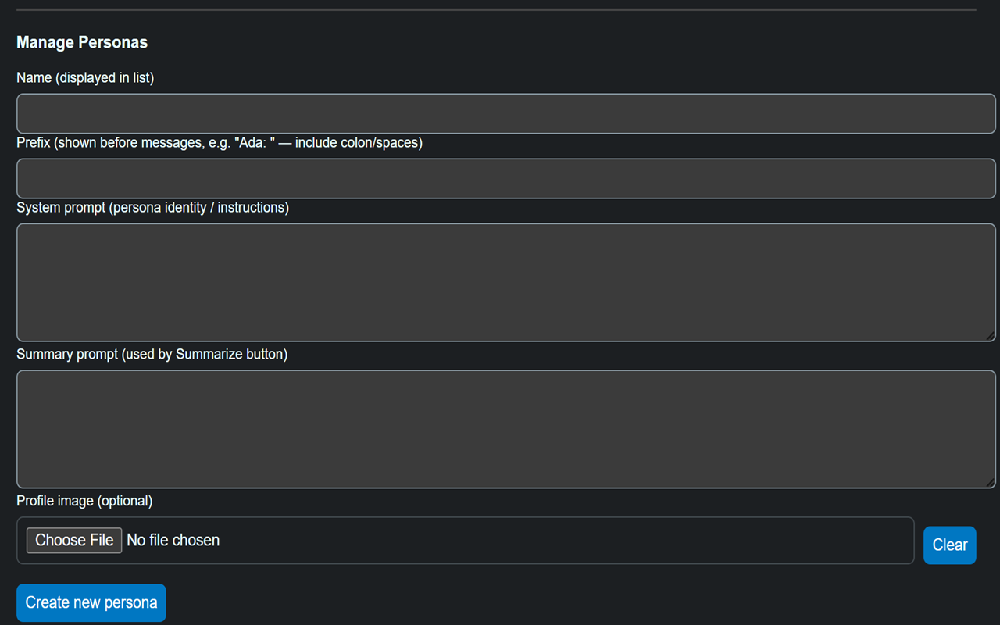
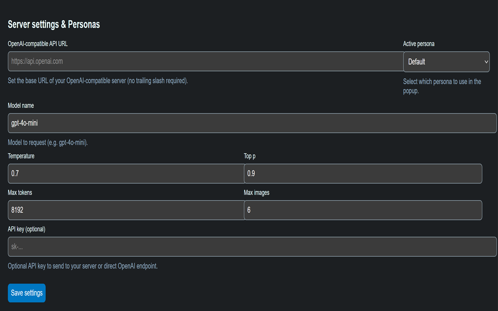

# Personify: AI-Powered Webpage Summarization with Personality

## Overview

Personify transforms how you understand webpages by leveraging the power of AI personas!  Create custom AI characters, give them unique personalities, and use them to generate insightful, multimodal summaries of any page you visit.  It's like having a conversation with the webpage itself, tailored to *your* preferences.

## Getting Started

Here's a quick look at how Personify works:
1. **Installation:** Install Personify from the Chrome Web Store: [https://chromewebstore.google.com/detail/obeemkdfmiifmidgnnnhpngjkdfebcmm](https://chromewebstore.google.com/detail/obeemkdfmiifmidgnnnhpngjkdfebcmm)
2. **API Configuration:** Add your OpenAI-compatible API key.
3. **Persona Creation:** Design your AI character! Give them a name, profile picture, and personality.
4. **Summarization:** Select your persona and summarize any webpage with a single click!
5. **Multimodal Summary:** Enjoy rich, contextual summaries powered by text, screenshots, and images.

## Features

* **Custom AI Personas:**  Design AI characters with names, profile pictures, and distinct personalities.
* **Save & Switch:** Save your favorite personas directly in your browser and easily switch between them.
* **Import/Export:** Share your creations with friends, family, or colleagues!
* **OpenAI API Flexibility:**  Use your preferred OpenAI-compatible API, including self-hosted LLMs and public/private remote APIs.
* **Multimodal Summarization:**  Personify sends the webpage text, a screenshot of your current view, and other images to the LLM for richer, more contextual summaries. (Requires a multimodal-capable LLM to get the full effect).
* **Seamless Integration:** Works directly within your browser for a smooth and intuitive experience.

## Technical Details

* **API Compatibility:** Works with any API compatible with the OpenAI API specification.
* **Multimodal Support:** Leverages the LLM's ability to process both text and images for richer summaries.
* **Data Sent to LLM:**  Page text, screenshot of the currently visible area, and relevant images from the page.
* **Browser Support:** Currently supports Chrome.

## Built With

* JavaScript
* HTML
* CSS
* [Manifest V3](https://developer.chrome.com/docs/extensions/mv3/)

## Examples
   
   
   
   
   
   

## Credits

* **Author:** [x.com/037](https://x.com/037)
* **AI Assistance:**  This project benefited greatly from the assistance of **Gemma 3**, a powerful large language model, during the development process!  Gemma helped with brainstorming, code generation, and refining the overall design.

## Contributing

Contributions are welcome!  Feel free to submit pull requests or open issues on the GitHub repository.

## License

[MIT License](LICENSE)
